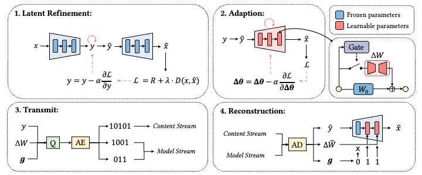
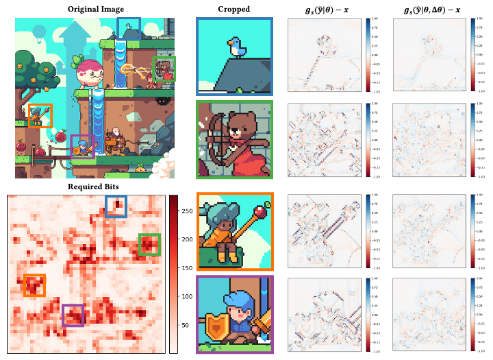

## EDUCATION BACKGROUND

### **Master**  \| Tsinghua University \| 2021.09 - 2024.06
 
Tsinghua Shenzhen International Graduate School 

### **Bachelor** \| Harbin Institute of Technology \| 2017.08 - 2021.06
 
School of Computer Science and Technology
 
---

## INTERNSHIP EXPERIENCE

### Tencent Inc. | AILab | research intern | 2022.05 - Present

Research in neural image compression.

---

## PUBLICATIONS

### Under review

